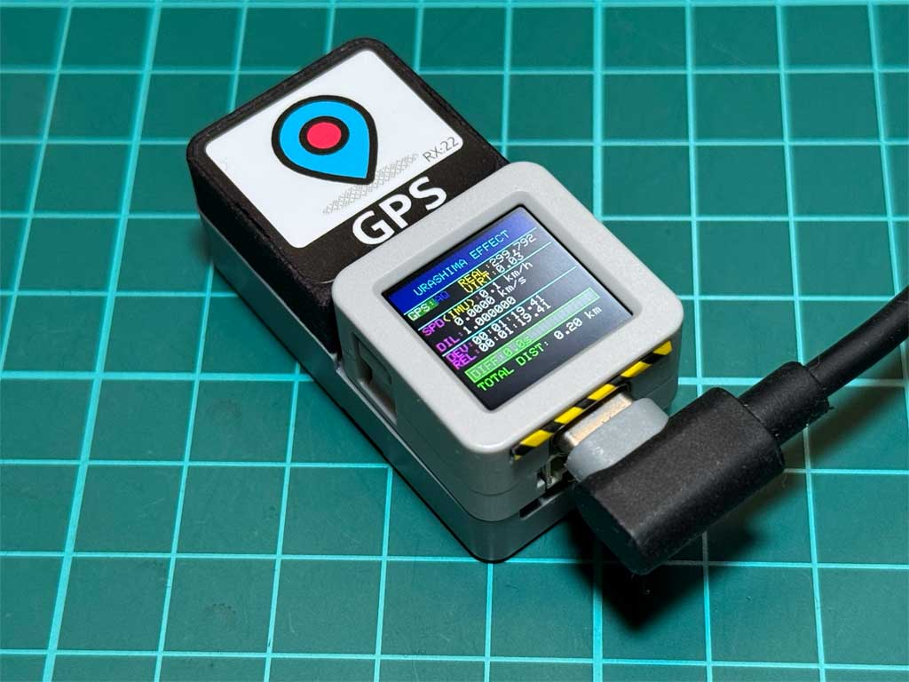
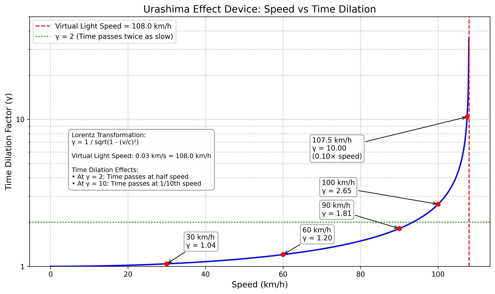

# Urashima Effect Device



## Overview

The Urashima Effect Device is a portable gadget designed to demonstrate time dilation effects based on Einstein's Theory of Special Relativity. It's named after the Japanese folktale "Urashima Taro," in which the protagonist spends what feels like a few days at the Dragon Palace, only to return home and find that hundreds of years have passed in the real world.

This device uses an M5Stack AtomS3R with an AtomicBase GPS unit to simulate relativistic time dilation in real-time based on your movement speed.

## The Urashima Taro Legend

The name "Urashima Effect" comes from the famous Japanese folktale of Urashima Taro, which dates back over 1,500 years. In the story, a young fisherman named Urashima Taro rescues a turtle, which turns out to be a princess from the Dragon Palace (Ryūgū-jō) beneath the sea. As a reward, he is invited to the underwater palace where he enjoys a few days of hospitality.

When Urashima decides to return home, he is given a mysterious box (tamatebako) with instructions never to open it. Upon returning to his village, he discovers that 300 years have passed in what felt like only a few days to him. In his shock and confusion, he opens the forbidden box, which releases a cloud of white smoke that instantly transforms him into an old man – his true age catching up with him.

This ancient tale presents a fascinating parallel to Einstein's relativistic time dilation, where time can pass at different rates for observers in different reference frames. Just as Urashima experienced time at a different rate in the Dragon Palace, our device demonstrates how movement affects the passage of time according to the Theory of Special Relativity.

## Features

- **Real-time relativistic time dilation calculation**: Computes time dilation based on movement speed using Einstein's Special Relativity equations
- **GPS speed measurement**: Accurate velocity tracking with a high-precision GPS module
- **GPS-IMU sensor fusion**: Combines GPS and IMU data for improved speed accuracy, with fallback to IMU-only when GPS is unavailable
- **Accelerometer backup**: Estimates speed using the built-in accelerometer when GPS signals are weak
- **Time and distance reset**: Long-press the button to reset elapsed time and distance measurements
- **SD card logging**: Records movement data and time dilation effects to CSV files
- **Compact design**: Displays essential information on the M5Stack AtomS3R's small screen
- **Battery-powered**: Built-in battery for outdoor use

## Hardware Requirements

- M5Stack AtomS3R
- M5Stack AtomicBase GPS
- microSD card (optional, for data logging)

## Hardware Connection

The AtomS3R and AtomicBase GPS have specific pin connections that must be properly configured:

### GPS Connection
- GPS_TX_PIN: 5 (AtomS3R GPIO5 for receiving data from GPS)
- GPS_RX_PIN: -1 (Not connected)

### SD Card Connection (AtomS3R with AtomicBase GPS)
- SD_MOSI_PIN: 6 (MOSI pin G6)
- SD_MISO_PIN: 8 (MISO pin G8)
- SD_SCK_PIN: 7 (CLK pin G7)
- SD_CS_PIN: 38 (CS pin G38)

**Note**: It's crucial to use GPIO38 for the SD card CS pin to avoid conflicts with the GPS module on GPIO5.

## Software Requirements

- Arduino IDE
- Required libraries:
  - M5Unified (v0.1.6 or later)
  - TinyGPS++
  - SPI
  - SD
  - FS
  - Preferences

## Installation

1. Clone or download this repository
2. Open `Urashima_Effect_Device.ino` in the Arduino IDE
3. Install all required libraries through the Arduino Library Manager
4. Select the M5Stack AtomS3R board (m5stack:esp32:m5stack_atoms3r)
5. Compile and upload to your device

## Usage

1. Power on the device to see the startup screen
2. Move to an outdoor location or near a window to acquire GPS signals
3. Once GPS signals are acquired, the current speed and time dilation effects will be displayed
4. Short press the physical button to cycle through display modes:
   - Main display (speed, time dilation)
   - GPS raw data display
   - IMU raw data display
5. Long press the physical button (2 seconds) to enter reset confirmation mode:
   - Press the button again to reset elapsed time, relativistic time, and total distance
   - Wait 5 seconds to cancel the reset operation
   - Confirmation and cancellation messages will be displayed

## How It Works

This device calculates time dilation based on Einstein's Theory of Special Relativity. Since the actual speed of light (approximately 300,000 km/s) would make time dilation effects imperceptible at everyday speeds, this device uses a virtual "modified light speed" (0.03 km/s) to exaggerate the effect.

This allows you to experience significant time dilation effects even when walking or driving. For example, moving at 60 km/h will show a noticeable slowing of time compared to someone who is stationary.

The time dilation is calculated using the Lorentz factor:

γ = 1/√(1-(v²/c²))

Where:
- γ (gamma) is the time dilation factor
- v is your current speed
- c is the modified speed of light (0.03 km/s or 108 km/h)

## Time Dilation Visualization

The following graph illustrates the relationship between speed and time dilation in the Urashima Effect Device:



As shown in the graph, time dilation effects become increasingly pronounced as your speed approaches the virtual light speed of 108 km/h:

- At 30 km/h: Time passes at approximately 0.96× normal rate (γ ≈ 1.04)
- At 60 km/h: Time passes at approximately 0.87× normal rate (γ ≈ 1.15)
- At 90 km/h: Time passes at approximately 0.64× normal rate (γ ≈ 1.56)
- At 100 km/h: Time passes at approximately 0.48× normal rate (γ ≈ 2.08)

## Troubleshooting

### Display Not Updating
If the display is not updating properly when pressing the button:
- Ensure you're using the correct pin configurations for both GPS and SD card
- Make sure SD_CS_PIN is set to 38 to avoid conflicts with GPS on GPIO5
- Check that the button handling uses `M5.BtnA.wasClicked()` instead of `wasPressed()`

### SD Card Not Working
If the SD card is not being detected or causing display issues:
- Verify the SD card is properly formatted (FAT32)
- Ensure the SD card pins are correctly configured:
  ```
  SD_MOSI_PIN: 6
  SD_MISO_PIN: 8
  SD_SCK_PIN: 7
  SD_CS_PIN: 38
  ```
- Make sure the SPI initialization is done with `SPI.begin(SD_SCK_PIN, SD_MISO_PIN, SD_MOSI_PIN, SD_CS_PIN)`
- Use `SD.begin(SD_CS_PIN)` without additional parameters

### GPS Not Receiving Data
- Ensure GPS_TX_PIN is set to 5
- Move to an area with better GPS reception
- Check the serial connection settings (9600 baud rate)

## Contributing

Contributions to the Urashima Effect Device project are welcome! Please feel free to submit pull requests or open issues to improve the device's functionality or documentation.

## License

This project is licensed under the MIT License - see the LICENSE file for details.

## Acknowledgments

- Einstein's Theory of Special Relativity
- The Japanese folktale of Urashima Taro
- M5Stack for their excellent hardware and software ecosystem
